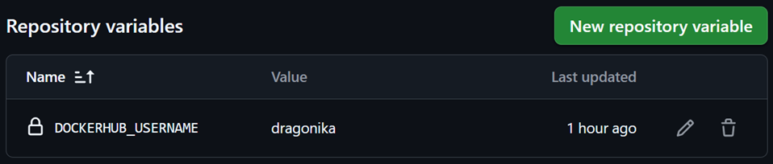
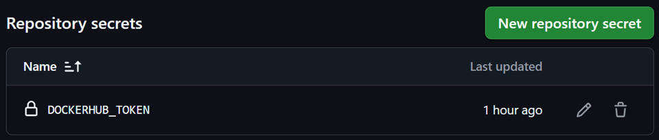
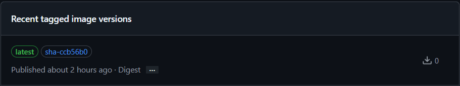
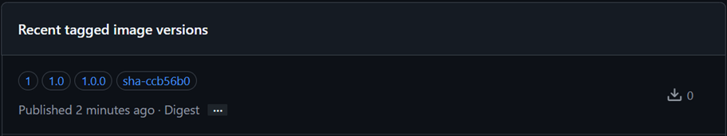
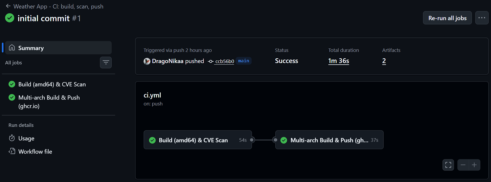
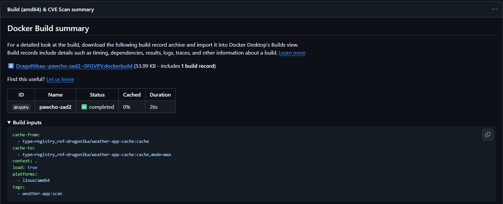
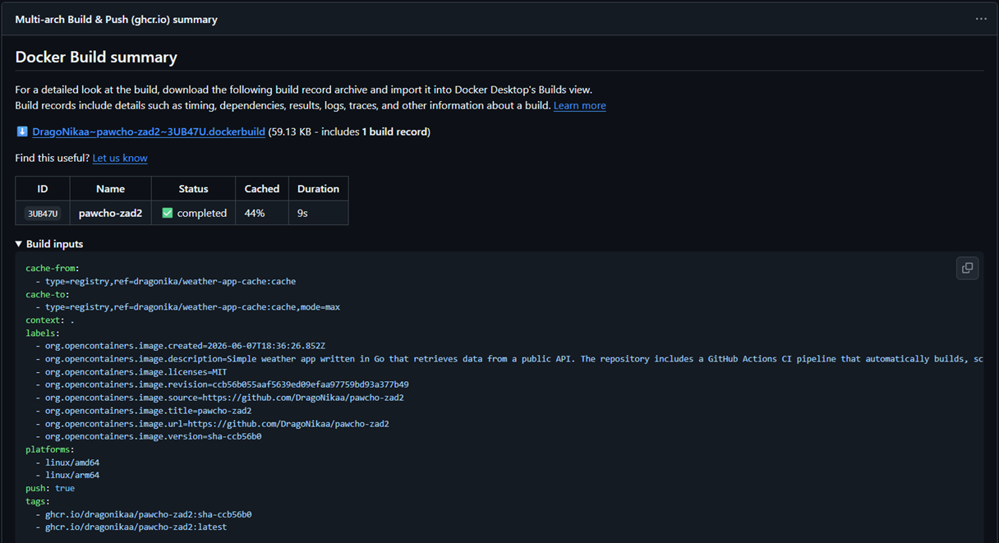
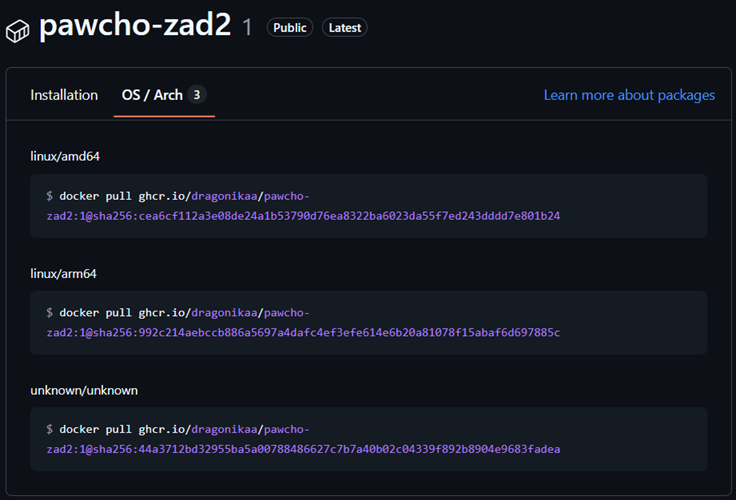

## Architektura pipeline'u
*Pipeline* składa się z **dwóch sekwencyjnych jobów**:
- **Job 1** – buduje obraz dla *linux/amd64* z flagą [`load: true`](.github/workflows/ci.yml#L40), co powoduje załadowanie go wyłącznie do demona *Dockera* na danym runnerze, bez publikowania go w zewnętrznym rejestrze.
- **Job 2** – uruchamia się tylko po sukcesie Joba 1 ([`needs: scan`](.github/workflows/ci.yml#L60)) i dopiero wtedy buduje obraz dla obu architektur oraz wysyła go do [ghcr.io](https://github.com/features/actions), co gwarantuje, że żaden obraz zawierający podatności *CRITICAL* lub *HIGH* nie trafi do publicznego rejestru.

Budowanie wielokrotne (Job 1 dla *amd64*, Job 2 dla *amd64*+*arm64*) jest wydajne, ponieważ **cache na Docker Hub** zapisany przez Job 1 jest natychmiast odczytywany przez Job 2. Warstwy *amd64* są już gotowe, więc Job 2 buduje je błyskawicznie z cache'u. Jedynie *arm64* budowany jest od zera (i zapisywany do cache'u dla kolejnych uruchomień).
<br><br>
## Dane cache
*Cache* przechowywany jest w dedykowanym, publicznym repozytorium na **Docker Hub**:<br>
https://hub.docker.com/repository/docker/dragonika/weather-app-cache

Zastosowanie `mode=max` sprawia, że silnik budowania zapamiętuje wszystkie etapy procesu, a nie tylko wynik końcowy. Przyspiesza to kolejne iteracje, ponieważ eliminuje potrzebę powtarzania kosztownych zadań od zera. Dzięki zapisywaniu cache'u w *Docker Hub* pod dedykowanym tagiem `cache`, jest zapewniona separacja danych tymczasowych od finalnego obrazu aplikacji trafiającego do [ghcr.io](https://github.com/features/actions). Takie podejście pozwala w pełni wykorzystać potencjał *BuildKit* przy jednoczesnym zachowaniu czystości rejestru produkcyjnego, wolnego od zbędnych warstw pośrednich.
<br><br>
## Skanowanie CVE – Trivy vs Docker Scout
Kluczowym wymaganiem zadania było skanowanie obrazu **przed wysłaniem do rejestru**. Oznacza to, że skanowany obraz istniał tylko lokalnie na runnerze.

- **Trivy** potrafi bezpośrednio skanować obraz załadowany do lokalnego demona *Dockera* bez konieczności push-owania go gdziekolwiek.
- **Docker Scout** w trybie *GitHub Actions* optymalnie działa na obrazach dostępnych w rejestrze lub wymaga dodatkowej konfiguracji dla obrazów lokalnych. Wymaga też aktywacji usługi *Scout* na koncie *Docker Hub*.

**Trivy** jest prostszy, nie wymaga żadnych dodatkowych kont ani konfiguracji poza jednym krokiem w *workflow*, a jego bazy *CVE* pokrywają podatności zarówno w bibliotekach systemów operacyjnych jak i bibliotekach języków programowania.
<br><br>
## Schemat tagowania obrazów
| Trigger             | Wygenerowane tagi obrazu           |
|---------------------|------------------------------------|
| `push branch main`  | `latest`, `sha-ccb56b0`            |
| `push tag v1.2.3`   | `1.2.3`, `1.2`, `1`, `sha-a1b2c3d` |
| `workflow_dispatch` | `sha-c7d8e9f`                      |

Szczegółową konfigurację można zobaczyć w [docker/metadata-action](.github/workflows/ci.yml#L94-L100).
<br><br>
### 1. Semantic Versioning (SemVer)
Schemat tagowania oparty jest na standardzie [Semantic Versioning 2.0.0](https://semver.org/), który definiuje wersję jako `MAJOR.MINOR.PATCH`:
- **MAJOR** – zmiana niekompatybilna wstecznie (breaking change),
- **MINOR** – nowa funkcjonalność zachowująca kompatybilność,
- **PATCH** – poprawka błędu.

Generowanie **trzech wariantów taga SemVer** (`1.2.3`, `1.2`, `1`) daje użytkownikom obrazu elastyczność:
- `image:1` – zawsze najnowsza wersja major 1 (automatyczne aktualizacje *minor*/*patch*),
- `image:1.2` – aktualizacje tylko w zakresie *patch*,
- `image:1.2.3` – dokładnie ta wersja, bez żadnych automatycznych aktualizacji.
<br><br>
### 2. Tag SHA commita
Tag w formacie `sha-{short_hash}` (np. `sha-ccb56b0`) jest generowany przy każdym uruchomieniu pipeline'u, niezależnie od tego czy push taga miał miejsce. Zapewnia to:
- pełną identyfikowalność, ponieważ zawsze wiadomo, z którego dokładnie commita pochodzi obraz,
- możliwość testowania obrazów z gałęzi `main` bez konieczności tworzenia wersji *SemVer*,
- wsparcie dla procesu `workflow_dispatch`, który uruchamia *pipeline* ręcznie bez przypisanego taga.
<br><br>
### 3. Warunkowy tag `latest` (śledzenie gałęzi `main`)
Zastosowanie warunku [`latest=${{ github.ref == 'refs/heads/main' }}`](.github/workflows/ci.yml#L95) pozwala na ograniczenie generowania taga `latest` wyłącznie do gałęzi głównej. Jest to podejście hybrydowe, które łączy wygodę śledzenia najnowszych zmian z bezpieczeństwem wersji stabilnych. Zapewnia to:
- szybki dostęp i łatwe pobranie aktualnej wersji rozwojowej aplikacji bez konieczności każdorazowego sprawdzania numeracji wersji czy hasha commita,
- bezpieczeństwo wydanych wersji, ponieważ dzięki ograniczeniu tylko do `main`, tag `latest` nie jest nadpisywany podczas publikacji stabilnych wersji (tagów `v*`). Chroni to przed sytuacją, w której `latest` przypadkowo wskazywałby na starszą wersję (np. podczas wydawania poprawki dla starszej wersji `v1.0.x`).
<br><br>
## Weryfikacja poprawnego wykonania zadania
W ustawieniach repozytorium na *GitHub* zostały utworzone **zmienna** oraz **secret** pozwalające na dostęp do *Docker Hub*:




Wykonane polecenia i odpowiadające im wygenerowane tagi:
```bash
git commit -m "initial commit"
git push origin main
```



```bash
git tag -a "v1.0.0" -m "first production version"
git push origin tag v1.0.0
```



Sprawdzenie pomyślnego przebiegu *workflow*:





Potwierdzenie zbudowania obrazu dla dwóch architektur (*amd64*+*arm64*):

